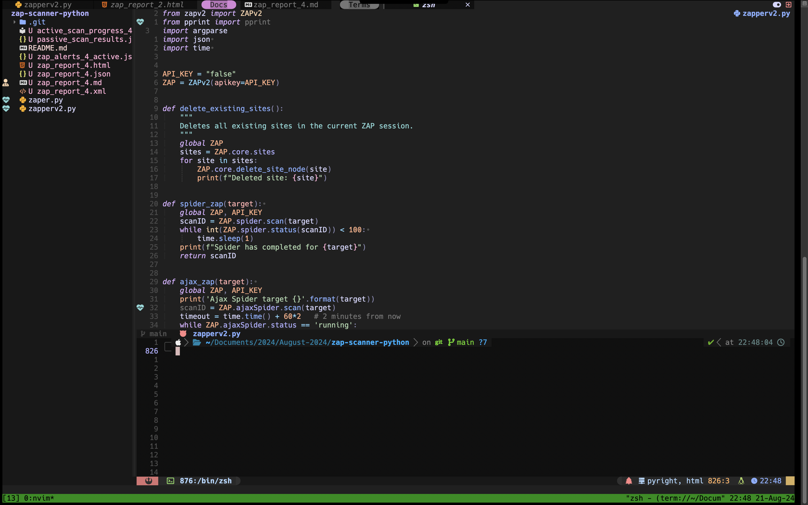

Basic Lunarvim config just added few plugins for Python and Markdown

## Install 
```bash 
bash <(curl -s "https://raw.githubusercontent.com/lunarvim/lunarvim/master/utils/installer/install.sh")
rm -rf ~/.config/lvim # or mv  ~/.config/lvim ~/.config/lvim_backup
git clone https://github.com/assaabriiii/lvim-config.git ~/.config/lvim
lvim +LvimUpdate +LvimCacheReset +q
lvim
```

after starting lvim don't forget to: 
```vim 
:LazySync
```

## Preview 
